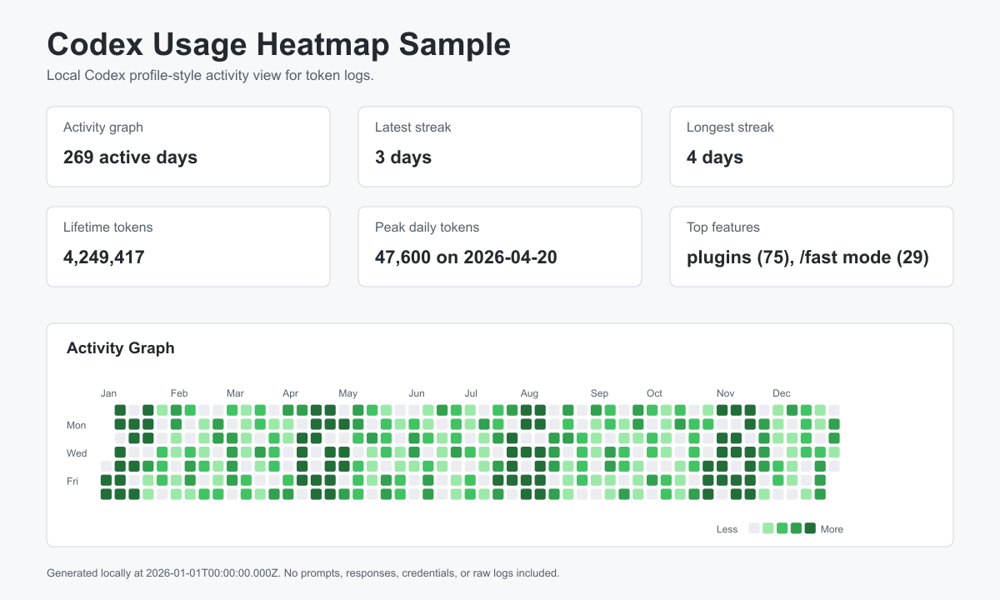

# Codex Usage Heatmap

View local Codex activity as a profile-style dashboard: activity graph, streaks,
lifetime tokens, peak daily tokens, and feature hints such as plugins and `/fast` mode.



## Features

- Scans local Codex JSONL logs without requiring an OpenAI API key.
- Aggregates input, cached input, output, reasoning output, and total tokens by day.
- Renders a GitHub-style activity graph as standalone SVG.
- Shows profile-style stats: latest streak, longest streak, lifetime tokens, peak daily
  tokens, active days, and date range.
- Detects explicit local feature hints for plugins and `/fast` mode when those fields are
  present in logs.
- Generates a static HTML report with JSON and CSV exports.
- Includes an optional native macOS menu bar utility that wraps the same local CLI data.
- Includes privacy-first discovery, sensitive file skipping, and path redaction.
- Works offline by default and makes no network calls.
- Provides deterministic sample data for demos and tests.
- Includes a reusable Codex Skill for maintainers.

## Installation

Run directly:

```bash
pnpm dlx codex-usage-heatmap doctor
```

Or install from a local checkout:

```bash
pnpm install
pnpm build
pnpm link --global
```

## Quickstart

```bash
pnpm dlx codex-usage-heatmap doctor
pnpm dlx codex-usage-heatmap report
open ./codex-usage-report/index.html
```

Use sample output when real local logs are unavailable:

```bash
pnpm dlx codex-usage-heatmap sample --out ./sample-report
open ./sample-report/index.html
```

## Native macOS Menu Bar Utility

The optional menu bar utility is a native Swift/AppKit app that calls the built CLI locally.
It shows compact Codex usage profile metrics in the macOS menu bar and can generate/open the
HTML report from its menu.

Build and run from a local checkout:

```bash
pnpm install
pnpm build
pnpm macos:menubar
```

Run a one-shot JSON snapshot without opening a GUI:

```bash
CODEX_USAGE_SOURCE=fixtures pnpm macos:menubar -- --once --debug
```

Install a local `.app` bundle to the Desktop:

```bash
./scripts/install-macos-menu-bar.sh
open "$HOME/Desktop/Codex Usage Heatmap.app"
```

Useful environment variables:

- `CODEX_USAGE_HEATMAP_CLI`: absolute path to `dist/cli.js`.
- `CODEX_USAGE_HEATMAP_REPO_ROOT`: checkout root used for reports and sample output.
- `CODEX_USAGE_SOURCE`: source passed to `cuh scan` and `cuh report`.
- `CODEX_USAGE_REPORT_DIR`: report output directory opened from the menu.
- `CODEX_USAGE_MENU_POLL_INTERVAL`: polling interval in seconds, clamped from 15 to 3600.

## Commands

```bash
cuh scan
cuh scan --source auto
cuh scan --source ~/.codex
cuh scan --since 2026-01-01 --until 2026-12-31
cuh doctor
cuh report
cuh report --out ./report
cuh svg --out ./codex-usage.svg
cuh export --format json --out ./usage.json
cuh export --format csv --out ./usage.csv
cuh sample --out ./sample-report
cuh skill-install --scope repo
cuh skill-install --scope user
```

`cuh report` creates `index.html`, `usage.json`, `usage.csv`, `codex-usage.svg`, and
`profile-preview.svg`.
The HTML report includes an activity graph, streak cards, lifetime token totals, peak
daily token totals, and a Top Features table.

## Privacy & Security

This tool is local-only by default. It does not require an OpenAI API key, does not upload
data, and does not make network calls. Generated reports include aggregated usage data only.

The scanner avoids credential-like paths such as `auth.json`, `.env`, cookies, token stores,
private keys, and sensitive configuration files. By default, diagnostics redact local
absolute paths. Use `--include-paths` only when you explicitly want paths in diagnostics.

Generated reports include this notice:

> This report was generated locally. It does not include prompts, responses, credentials, or
> raw logs.

## What Data Is Parsed

The parser adapters look for Codex-like token usage metadata in JSONL records, including
`last_token_usage`, `total_token_usage`, `input_tokens`, `cached_input_tokens`,
`output_tokens`, `reasoning_output_tokens`, and `total_tokens`.

If only cumulative totals are available, the scanner calculates deltas within the same
session when possible. If a delta cannot be calculated, the event is marked as estimated.

Feature hints are collected only from explicit metadata fields such as `plugin`, `plugins`,
`feature`, `features`, `fastMode`, `fast_mode`, `mode`, or `/fast` command fields. The
scanner does not inspect prompt or response text to infer features.

## Limitations

- Codex log schemas may change.
- Token count availability depends on what Codex logs locally.
- This is not an official OpenAI billing, quota, or account usage source.
- Local logs may not match account billing.
- Codex Profile metrics in this project are derived from locally available logs, not from
  OpenAI account-side profile data.
- The macOS menu bar utility requires macOS, Swift tooling, Node.js, and a built local CLI.
  It is not notarized or distributed as a signed app bundle.
- Lifetime tokens, streaks, and peak daily tokens may be incomplete if older local logs are
  missing or were rotated.
- Top feature counts require explicit local log fields for plugins or `/fast` mode. If those
  fields are absent, the report shows `No local evidence`.
- Some events may be estimated when only cumulative totals are available.
- Generated reports are only as complete as the local logs available on the machine.
- Timestamp handling is conservative. Missing timestamps fall back to file metadata only when
  no safer timestamp is available.
- Parser support is intentionally adapter-based because observed schemas can vary by Codex
  version and runtime.

## Codex Skill Usage

The repository includes a skill at `.agents/skills/codex-usage-heatmap/`. Install or refresh
it with:

```bash
cuh skill-install --scope repo --force
cuh skill-install --scope user --force
```

## Development

```bash
pnpm install
pnpm dev doctor
pnpm dev scan --json --source fixtures
pnpm dev sample --out ./tmp/sample-report
```

## Testing

```bash
pnpm lint
pnpm typecheck
pnpm test
pnpm build
pnpm check:language
```

## Release

```bash
pnpm verify
pnpm sample
npm pack --dry-run
```

Review the generated report and package contents before publishing.

## License

MIT

## Acknowledgements

Inspired by GitHub Contributions-style heatmaps and
`sallar/github-contributions-chart`. This project is implemented independently and does not
copy their code.
