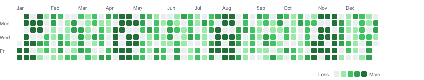

# Codex Usage Heatmap

Visualize your local Codex token usage as a GitHub-style heatmap.



## Features

- Scans local Codex JSONL logs without requiring an OpenAI API key.
- Aggregates input, cached input, output, reasoning output, and total tokens by day.
- Renders a GitHub-style heatmap as standalone SVG.
- Generates a static HTML report with JSON and CSV exports.
- Includes privacy-first discovery, sensitive file skipping, and path redaction.
- Works offline by default and makes no network calls.
- Provides deterministic sample data for demos and tests.
- Includes a reusable Codex Skill for maintainers.

## Installation

Run directly:

```bash
pnpm dlx codex-usage-heatmap doctor
```

Or install from a local checkout:

```bash
pnpm install
pnpm build
pnpm link --global
```

## Quickstart

```bash
pnpm dlx codex-usage-heatmap doctor
pnpm dlx codex-usage-heatmap report
open ./codex-usage-report/index.html
```

Use sample output when real local logs are unavailable:

```bash
pnpm dlx codex-usage-heatmap sample --out ./sample-report
open ./sample-report/index.html
```

## Commands

```bash
cuh scan
cuh scan --source auto
cuh scan --source ~/.codex
cuh scan --since 2026-01-01 --until 2026-12-31
cuh doctor
cuh report
cuh report --out ./report
cuh svg --out ./codex-usage.svg
cuh export --format json --out ./usage.json
cuh export --format csv --out ./usage.csv
cuh sample --out ./sample-report
cuh skill-install --scope repo
cuh skill-install --scope user
```

`cuh report` creates `index.html`, `usage.json`, `usage.csv`, and `codex-usage.svg`.

## Privacy & Security

This tool is local-only by default. It does not require an OpenAI API key, does not upload
data, and does not make network calls. Generated reports include aggregated usage data only.

The scanner avoids credential-like paths such as `auth.json`, `.env`, cookies, token stores,
private keys, and sensitive configuration files. By default, diagnostics redact local
absolute paths. Use `--include-paths` only when you explicitly want paths in diagnostics.

Generated reports include this notice:

> This report was generated locally. It does not include prompts, responses, credentials, or
> raw logs.

## What Data Is Parsed

The parser adapters look for Codex-like token usage metadata in JSONL records, including
`last_token_usage`, `total_token_usage`, `input_tokens`, `cached_input_tokens`,
`output_tokens`, `reasoning_output_tokens`, and `total_tokens`.

If only cumulative totals are available, the scanner calculates deltas within the same
session when possible. If a delta cannot be calculated, the event is marked as estimated.

## Limitations

- Codex log schemas may change.
- Token count availability depends on what Codex logs locally.
- This is not an official OpenAI billing, quota, or account usage source.
- Local logs may not match account billing.
- Some events may be estimated when only cumulative totals are available.
- Generated reports are only as complete as the local logs available on the machine.
- Timestamp handling is conservative. Missing timestamps fall back to file metadata only when
  no safer timestamp is available.
- Parser support is intentionally adapter-based because observed schemas can vary by Codex
  version and runtime.

## Codex Skill Usage

The repository includes a skill at `.agents/skills/codex-usage-heatmap/`. Install or refresh
it with:

```bash
cuh skill-install --scope repo --force
cuh skill-install --scope user --force
```

## Development

```bash
pnpm install
pnpm dev doctor
pnpm dev scan --json --source fixtures
pnpm dev sample --out ./tmp/sample-report
```

## Testing

```bash
pnpm lint
pnpm typecheck
pnpm test
pnpm build
pnpm check:language
```

## Release

```bash
pnpm verify
pnpm sample
npm pack --dry-run
```

Review the generated report and package contents before publishing.

## License

MIT

## Acknowledgements

Inspired by GitHub Contributions-style heatmaps and
`sallar/github-contributions-chart`. This project is implemented independently and does not
copy their code.
